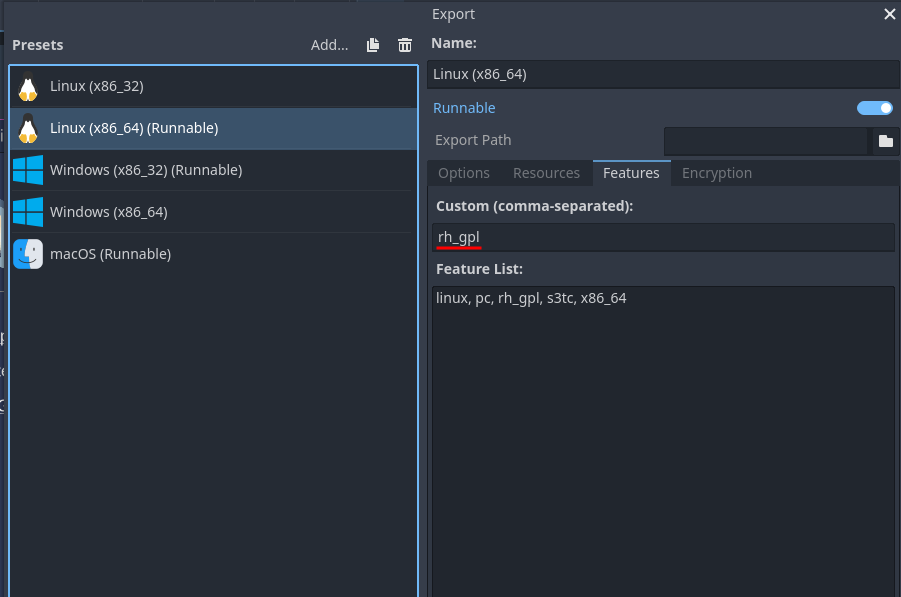

.. _app_using_licensing:

Licensing Concerns
==================

RetroHub is freely available under the `MIT License <https://github.com/retrohub-org/retrohub/blob/main/LICENSE>`_. In a nutshell, you can use it for any purpose, including commercial usage. There are still some considerations you'll need to have in mind if you intend to use the RetroHub codebase.

You can find detailed licensing information on RetroHub's **About** panel.

Bundled libraries
-----------------

The released version of RetroHub makes usage of some `GPLv3 <https://www.gnu.org/licenses/gpl-3.0.en.html>`_ third-party libraries. This retroactively forces the distributed binary to be under GPLv3 as well. If you intend to use the following libraries, **your project will have to be under GPLv3**:

- `FFmpeg <https://ffmpeg.org/>`_ (used for video playback)

If you cannot use one or more of these libraries, here are some intructions in order to remove them:

- **FFmpeg**: This library is built as a GDExtension from `retrohub-org/godot-videodecoder <https://github.com/retrohub-org/godot-videodecoder>`_ and bundled in our CI. Therefore, you don't need to do anything in order to remove it. Make sure to modify the existing code to prevent RetroHub from trying to load unsupported formats like ``.mp4``.

If your project is released with a license other than GPLv3, modify the export settings in order to remove the ``rh_gpl`` flag.

Scraper services
----------------

API keys that have been provided for RetroHub are exclusive and cannot be used for your own project. If you intend to support such scraper services, you'll have to get in contact with each service in order to request permission for your project:

- `ScreenScraper <https://www.screenscraper.fr/>`_

Used assets
-----------

RetroHub's logo is licensed under `CC-BY-4.0 <https://creativecommons.org/licenses/by/4.0/>`_, being originally designed by `Lynn Pepin <https://github.com/lynnpepin>`_. While this license permits you to use this logo for your own projects (with attribution), please be reasonable with your usage. If your project is intended to stay connected to the original project then it's fine, but otherwise we ask you to design your own branding.

RetroHub ships with system assets that were manually obtained from ScreenScraper. Permission was given for the usage of these assets, but this permission is exclusive to RetroHub. If you intend to use these assets for your own projects, you'll have to get in contact with ScreenScraper to request permission as well. Regardless of that, these system assets, along with emulators icons, **cannot** be used in commercial projects, so if that's the case, they **must be** entirely removed from ``assets/systems`` and ``assets/emulators``.

For interface sounds, although most of them are `CC0 <https://creativecommons.org/publicdomain/zero/1.0/>`_ (public domain), some of them are not, and you'll have to consult each one of them individually.
