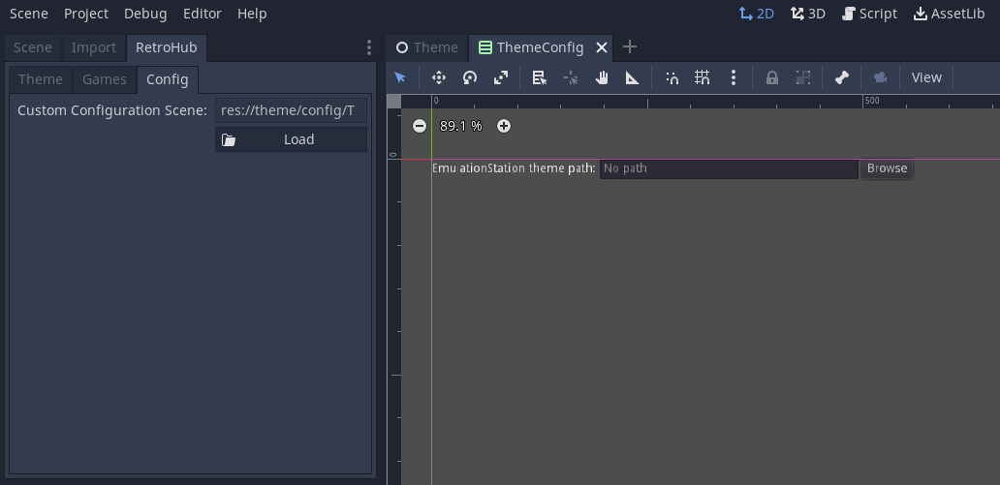

.. include:: /global/rh_actions.rst
.. include:: /global/godot_api.rst

.. _theme_section_configuration:

Theme Configuration
===================

Since RetroHub gives near complete freedom to theme developers on how games are presented and selected, it's very likely that you'll have behaviors that users will want to customize.

Use :ref:`api_RetroHubConfig`'s ``theme_config`` methods and signals to access and modify these settings:

.. code-block:: gdscript

	var dark_mode := false

	func _ready():
		RetroHubConfig.theme_config_ready.connect(_on_theme_config_ready)
		RetroHubConfig.theme_config_updated.connect(_on_theme_config_updated)

	func _on_theme_config_ready():
		dark_mode = RetroHubConfig.get_theme_config("dark_mode", false)

	func _on_theme_config_updated(key, old_value, new_value):
		if key == "dark_mode":
			dark_mode = new_value
			print("Dark mode changed from %s to %s" % [old_value, new_value])

Theme configurations are stored internally in a JSON file, and work as key/value pairs. Theoretically you can use any Godot's |godot_variant|, but it's recommended to stick to regular variable types, such as |godot_bool|, |godot_int|, |godot_float|, |godot_string|, |godot_vector2|, |godot_color|, etc...

When reading settings, you need to specify a default value in case that setting doesn't exist yet. To update settings, you only need to call ``set_theme_config``, and RetroHub will internally save it.

Showing configuration
---------------------

You have two main options for this:

.. note::
	These options are not mutually exclusive. You can use both if you want.

In-theme menu
^^^^^^^^^^^^^

Themes have a special input action available: **rh_theme_menu** (|action: rh_theme_menu| by default). You can use this to implement a configuration UI from within your theme.

.. warning::
	You will have to manually save this configuration by calling :ref:`save_theme_config <api_RetroHubConfig_save_theme_config>`.

In-app menu
^^^^^^^^^^^

If you want to integrate the configuration UI better in the app, you can also specify a scene for RetroHub to load and add to the configuration menu. This will be displayed under the "Theme" section. To do this, set a Custom Configuration Scene in the theme helper addon's configuration.

.. note::
	When using this approach, RetroHub will automatically save theme configuration when the theme is unloaded, so you don't need to do it manually.