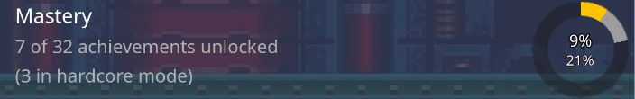
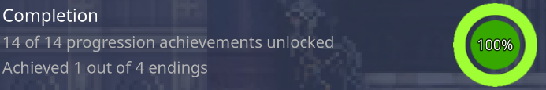
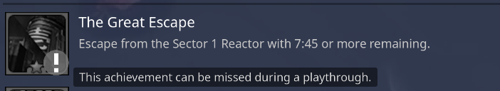

.. include:: /global/godot_api.rst

.. _theme_integrations_retroachievements:

RetroAchievements
=================

`RetroAchievements <https://retroachievements.org/>`__ is a service that introduces achievements on classic systems, such as the SNES, Genesis, PlayStation, and many others. It also tracks user progression, statistics, and allows them to compete with other players.

RetroHub can fetch the user's personal achievement information and progression.

.. image:: /global/assets/integrations/retroachievements_example.png

Setup
-----

As with all integrations, you need to query if they're available before you can create them:

.. code-block:: gdscript

	if not RetroAchievements.is_available():
		# Not available; warn the user of this
		...
		return

To setup RetroAchievements, create an instance of :ref:`api_RetroAchievements`, and add it to the scene tree:

.. code-block:: gdscript

	var retroachievements = RetroAchievements.new()
	add_child(retroachievements)

.. warning::

	Make sure to create only one instance in your whole theme. Multiple instances won't share cache, which will increase memory usage in your theme.

Obtaining achievement information
---------------------------------

To avoid dealing with raw API calls and parsing information by hand, this integration provides a high-level API, available at :ref:`api_RetroAchievements`, to fetch information about games and achievements directly. While for most scenarios this is sufficient, you can still access the raw API for other use cases, which is detailed on the :ref:`theme_integrations_retroachievements_api` section.

To query for game and achievement information, you need to call :ref:`RetroAchievements.get_game_info <api_RetroAchievements_get_game_info>` for a specific :ref:`api_RetroHubGameData`:

.. code-block:: gdscript

	var game_info = await retroachievements.get_game_info(game_data)

This call may take some time to complete, since it may connect to RetroAchievement's servers to fetch the information. Therefore, you'll need to use the ``await`` keyword to wait for the result without blocking your theme.

This call will always return a :ref:`api_RetroAchievements_GameInfo`, but that doesn't necessarily mean it has been successful. You should only proceed if there is no error:

.. code-block:: gdscript

	if game_info.err != RetroAchievements.GameInfo.Error.OK:
		# Handle error
		...
		return

Once that's checked, you now have access to the game's information and achievements. Check the :ref:`api_RetroAchievements_GameInfo` and :ref:`api_RetroAchievements_Achievement` class references for more information on what's available:

.. code-block:: gdscript

	print(game_info.game.player_count) # 7924
	for achievement in game_info.achievements:
		print(achievement.title) # "First Blood"
		print(achievement.description) # "Kill an enemy for the first time"
		print(achievement.type) # Achievement.Type.NORMAL
		print(achievement.unlocked) # true
		print(achievement.unlocked_hard_mode) # false
		print(achievement.unlocked_count) # 6823
		print(achievement.unlocked_hard_mode_count) # 4712

Loading achievement icons
-------------------------

Every achievement has an icon associated with it. To reduce load in both RetroHub and RetroAchievements' servers, these icons need to be loaded on demand. To do so, you can call :ref:`Achievement.load_icon <api_RetroAchievements_Achievement_load_icon>`:

.. code-block:: gdscript

	var texture = await achievement.load_icon()
	# Now assign the texture to some UI element
	...

This function will have some delay if it needs to download the icon. However, once downloaded, the icon is cached on the user's storage, so any subsequent calls will be much faster.

.. warning::

	Keep this function call to the bare minimum necessary. Downloads are queued and cannot be canceled, so any other API calls that need to download information will need to wait for the current queue to finish.

Handling error scenarios
------------------------

In the event that there is an error when fetching information, you should attempt to handle this scenario by informting the user on what's wrong, and any tips for fixing it.

Check the :ref:`GameInfo.Error <api_RetroAchievements_GameInfo_Error>` enumeration for a general description of each error. Since most of these errors are temporary, we recommend the following behaviors for tackling them:

- :ref:`RetroAchievements.is_available <api_RetroAchievements_is_available>` **returns** ``false``: The integration is disabled in the user settings, and themes cannot use it. You should inform the user of this, and allow them to enable it in the settings. You can open the settings panel directly with :ref:`RetroHubUI.open_app_config <api_RetroHubUI_open_app_config>`. To get notified of such changes, connect to the :ref:`RetroHubConfig.config_updated <api_RetroHubConfig_config_updated>` signal and listen for updates in the ``integration_rcheevos_enabled`` key.
- **ERR_INVALID_CRED**: The user's credentials are invalid; you should instruct them to fix this by opening settings, and ensuring the information is correct. You can also open the panel directly with :ref:`RetroHubUI.open_app_config <api_RetroHubUI_open_app_config>`. The integration reloads the credentials automatically on the next API call when this error occurs, so you don't need to do anything else.
- **ERR_CONSOLE_NOT_SUPPORTED**: The requested game's system is not supported by RetroAchievements. You should inform the user of this, and not attempt to fetch any information.
- **ERR_GAME_NOT_FOUND**: The requested game was not found. RetroAchievements only accepts some specific game hashes per game, so it's possible that the requested game is actually supported, but the file hash does not match any of the supported ones. Because the hashing process is not trivial, you should display the game's hash to help users troubleshoot the issue. You can obtain this value from :ref:`RetroAchievements.get_game_hash <api_RetroAchievements_get_game_hash>`.
- **ERR_NETWORK**: There was an error connecting to RetroAchievements' servers. This could be a temporary network issue on the user, or RetroAchievements' servers may be down. As it's usually temporary and fixable, you should allow users to retry a given request.
- **ERR_INTERNAL**: There was an internal error in RetroHub and/or Godot. This should never happen, so it's important to track and report this scenario. In any case, do allow the user to retry, as it may be a temporary error.

Interpreting RetroAchievements' data
------------------------------------

This serves as a primer on how RetroAchievements work, and how to interpret the data returned. For more information, you should check RetroAchievements' `documentation <https://docs.retroachievements.org>`__.

Hardmode
~~~~~~~~

Hardmode refers to a special mode offered by emulators where some features are restricted, such as savestates, rewind, and others. RetroAchievements allows achievements to be unlocked in both normal and hardmode, and tracks them separately.

The :ref:`api_RetroAchievements_Achievement` class has separate properties to track progression on both modes:

- :ref:`unlocked <api_RetroAchievements_Achievement_unlocked>` and :ref:`unlocked_count <api_RetroAchievements_Achievement_unlocked_count>` track the normal mode.

- :ref:`unlocked_hard_mode <api_RetroAchievements_Achievement_unlocked_hard_mode>` and :ref:`unlocked_hard_mode_count <api_RetroAchievements_Achievement_unlocked_hard_mode_count>` track the hardmode.

If an achievement was unlocked in hardmode, it's important to show that to the user, especially if some achievements are unlocked in normal mode only.

Progression
~~~~~~~~~~~

Some achievements have a special type that denotes some in-game progression. The :ref:`Achievement.Type <api_RetroAchievements_Achievement_Type_Enum>` enumeration lists such cases.

A game is considered completed if, and only if:

- **All** achievements marked as ``PROGRESSION`` are unlocked.

and

- **Any** achievement marked as ``WIN`` is unlocked.

You can use this information to show the user's progression in the game, and if they have completed it.

Missable achievements
~~~~~~~~~~~~~~~~~~~~~

Achievements marked as ``MISSABLE`` can be missed during a normal playthrough, so you may display them differently to inform this to the user.

.. _theme_integrations_retroachievements_api:

Raw API access
--------------

If you want to access the RetroAchievements' raw API, you can do so by directly calling the exposed endpoints at :ref:`api_RetroAchievements_Raw`.

You will receive raw JSON responses that you'll need to parse however you see fit. Check RetroAchievements' `documentation <https://api-docs.retroachievements.org>`__ for more information.

For almost all of these endpoints, you will need to supply an authentication dictionary with the user's credentials. You can obtain one from :ref:`RetroAchievements.build_auth <api_RetroAchievements_build_auth>`:

.. code-block:: gdscript

	var auth = RetroAchievements.build_auth()
	var response = await RetroAchievements.Raw.get_achievement_of_the_week(auth)

All these endpoints return a :ref:`api_RetroAchievements_Raw_Response` that contains error codes and the response JSON body already parsed into a |godot_array| or |godot_dictionary|.

.. warning::

	If the user's credentials are invalid (e.g. ``401`` HTTP errors), you will need to rebuild the authentication dictionary to refetch the credentials. You can do so by calling :ref:`RetroAchievements.build_auth <api_RetroAchievements_build_auth>` with the optional ``force_refetch`` argument to ``true``.
