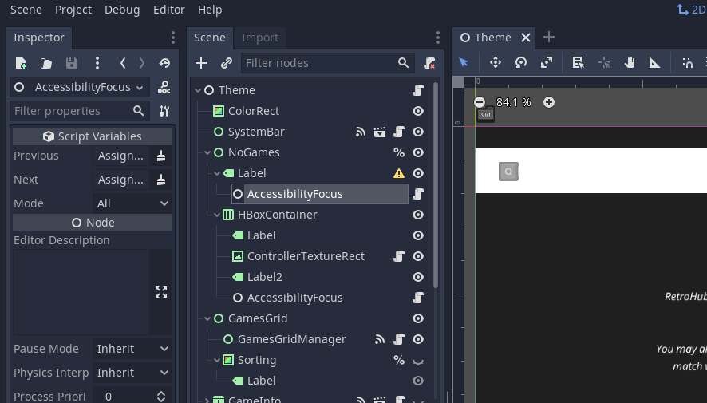
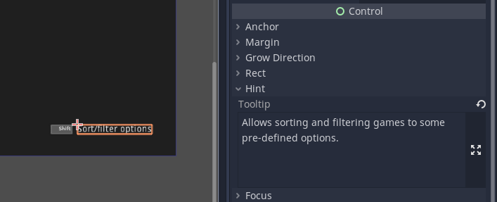

.. include:: /global/godot_api.rst

.. _theme_specific_accessibility_screen_readers:

Accessibility - Supporting screen readers
=========================================

A `screen reader <https://en.wikipedia.org/wiki/Screen_reader>`_ is a dedicated software that reads aloud content from the user's screen. It is used by people with partial or full visual impairments.

RetroHub supports screen readers in its interface by bundling two addons that together provide screen reader support for Godot projects: `godot-accessibility <https://github.com/lightsoutgames/godot-accessibility/>`_ for out-of-the-box support for Godot's UI nodes, and `godot-tts <https://github.com/lightsoutgames/godot-tts>`_ for interfacing with existing TTS software.

These addons were modified for RetroHub, and this page describes their functionality and how your theme can be adapted for screen reader usage.

.. note::
	Godot now has `native interfacing with TTS services <https://docs.godotengine.org/en/stable/tutorials/audio/text_to_speech.html>`_, but in testing it still isn't as reliable as the TTS addon. For now, this solution will stay, and in the future RetroHub will switch to the native solution when more stable.

Fundamentals
------------

If you've never developed for visually impaired users, these are the most important design principles to abide by:

- **Mouse input must not be necessary**: Most visually impaired users do not use a mouse, and instead use keyboards/controllers to fully navigate the UI.
- **UI navigation is 1D, instead of 2D**: The interface must be fully navigable by keyboard/controller and only with two keys, typically the Up and Down arrow keys on keyboard.
- **Avoid audio interference**: Be careful with background sounds playing. While some software can automatically lower the application's sound when TTS is active, you should take extra care to ensure any TTS speech is not being interfered with by other elements of your theme.

While these additional restrictions are likely to affect your theme development significantly, the way these addons interact, as well as modifications done to them, should make the process of adapting your theme very straightforward, and as a complement to the existing design.

Making necessary nodes focusable
--------------------------------

The addon works by detecting changes to the focused |godot_control|, and inspecting its content to read it aloud. However, Godot only makes interactible nodes focusable by default, leaving some essential nodes out (most notably |godot_label|).

For the screen reader to work, any |godot_control| node that should be transmitted to the user must be focusable. However, this would affect your existing designs for non-impaired users. To fix this, there's a special node to handle this: ``AccessibilityFocus``. This node detects when a screen reader is enabled, and modifies it's parent node's focus properties accordingly, while keeping the original configuration in case the user disables screen readers.

Likewise, if you use ``grab_focus`` to set an initial focus when your theme is loaded, you should adapt your theme to focus the appropriate node depending on the screen reader being enabled or not. You can check this setting through the :ref:`accessibility_screen_reader_enabled <api_ConfigData_accessibility_screen_reader_enabled>` property:

.. code-block:: gdscript

	func _ready():
		if RetroHubConfig.config.accessibility_screen_reader_enabled:
			$LabelNode.grab_focus()
		else:
			$ButtonNode.grab_focus()

Ensuring one-dimensional navigation
-----------------------------------

To support one-dimensional movement and selection on the UI, RetroHub changes the ``ui_up``/``ui_down`` mappings to ``ui_focus_next``/``ui_focus_prev`` respectively. Godot's automatic mechanism to detect next and previous elements takes into consideration both axis, and thus it can focus elements more reliably.

If you need more control on what neighbor nodes get focused, add a ``AccessibilityFocus`` node to the parent node, and set the ``previous`` and ``next`` properties to the appropriate nodes. Likewise, if there's an element that doesn't make sense to be focusable for 1D UI, you can set the ``focus_mode`` property accordingly.

It is also extremely important to make the UI navigation deterministic. Test your theme to ensure that when you cycle through the UI backwards, the same elements are being focused in the reverse order. You can still have the concept of entering (``rh_accept`) and exiting (``rh_back``) from certain elements for more specialized navigation.

The remaining UI interactions, such as sliding (``rh_left_trigger``/``rh_right_trigger``), do not need any special handling, other than making the user aware that these actions are available.

Controlling TTS output
----------------------

By default, this addon will output text according to the node's type. However, you can add more information or even control the TTS output you give to the user.

To better explain a given object's functionality, you can set the tooltip text for any node. The addon will append this text after the regular speech.

If you want to control the TTS output yourself, you can do that through a :ref:`tts_text <api_TTS_tts_text>` method. The addon will visit this node and parents recursively to check if this method exists, and if yes, use that as the output instead. This way, you can define your own text for any node, and have the flexibility of either defining this method in children node's scripts, or consolidating everything to a parent node.

.. code-block:: gdscript

	func tts_text(focused: Control) -> String:
		if focused == special_node:
			return "This is a special node!"
		else:
			# Empty strings make the addon keep visiting further nodes or eventually default to it's own output
			return ""

There are also more specialized methods for different node types, behaving similarly but giving more info. For more information on other available functions, check the :ref:`api_TTS` class.

Lastly, if you want to immediately speak a string of text, you can call :ref:`TTS.speak <api_TTS_speak>` directly:

.. code-block:: gdscript

	# Interrupts any current text
	TTS.speak("Hello")
	# Only speaks after any pending text is finished
	TTS.speak("World!", false)