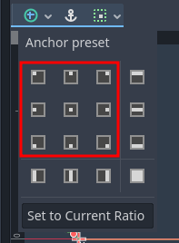

.. include:: /global/godot_api.rst

.. _theme_specific_aspect_rations:

Handling multiple aspect ratios
===============================

Screens have different sizes, and consequently different aspect ratios. While 16:9 has become the standard for most modern screens, there are plenty of other screens out there:

- Small variations, such as 16:10 (e.g. Steam Deck)
- Ultra-wide formats, such as 21:9
- Old "square" TVs, such as 4:3

RetroHub is likely to run on such scenarios, but it's infeasible to develop for every specific aspect ratio, and no doubt even more will come in the future. Instead, themes should be designed according to Godot's guidelines, allowing themes to dynamically change depending on the user's resolution.

Even when designing for 16:9, you should keep these tips in mind when designing your theme, and hopefully supporting more aspect ratios will be pretty easy. RetroHub automatically scales the theme's resolution to keep the same height in all cases. Therefore, only the width will change.

.. note::
	For more information on this topic, checkout `this Godot tutorial <https://docs.godotengine.org/en/3.1/getting_started/step_by_step/ui_introduction_to_the_ui_system.html>`_.

Identify corner elements
--------------------------

Corner elements are portions of your UI that should "stick" to a corner, and not grow in size if the aspect ratio is different.

To have them automatically "stick" to corners, you can set the Layout for a specific case.

Identify filler elements
------------------------

Filler elements are any portions of your UI you want to take all the available space.

To have them automatically take all the available space, you can set filler layouts for a specific case.

If those nodes have children, you'll need to set their size flags accordingly to use all the space available, such as **Fill** and **Expand**.

If you have a variable amount of elements (e.g. game entries), you can use |godot_flowcontainer| nodes to automatically fill and overflow elements.