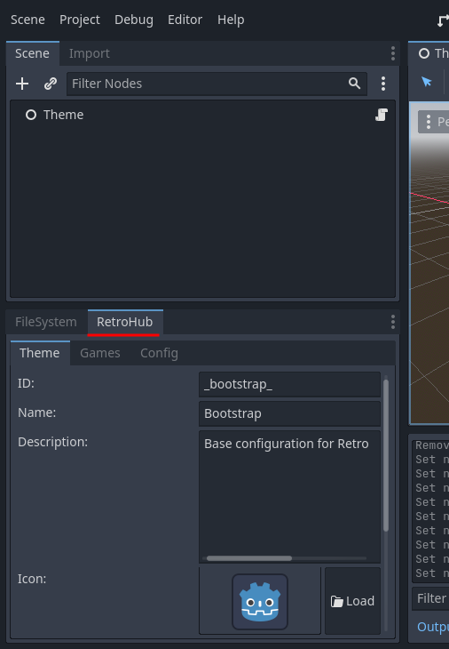

Preparing the project
=====================

Before starting, you need to setup the necessary tools, and prepare the project to properly develop themes.

What you'll need
----------------
Firstly, you'll need to get the official `Godot Editor v3.5 <https://godotengine.org/download>`_. Although RetroHub uses a custom version of Godot, the themes can be developed on the official version.

Next, you need a project pre-configured with RetroHub's settings, such as input keys, addons, etc... For that, we created a bootstrap project, which is a base that can be used for developing any theme. Download `retrohub_bootstrap_theme <https://github.com/retrohub-org/retrohub-bootstrap-theme>`_ and open it in Godot.

This project starts with many pre-applied configurations for RetroHub, but most notably it has an addon called ``retrohub-theme-helper``. This addon not only exposes RetroHub's API methods and variables, it also provides various tools to help in theme development.

Configuration
-------------

The first time you open the project, it will take some time to import resources. After that, you should change some settings to your liking. Start by setting your project name by going to **Project** > **Project Settings...**

- Ensure the ``RetroHub Theme Helper`` is enabled in the **Plugins** tab.

.. image:: assets/01-project_settings_plugins.png

- Close the project settings, and move to the **RetroHub** tab, nex to the **FileSystem** tab.

- Ensure the **Theme** tab is selected, and fill the information as follow:
	- **ID:** my_first_theme
	- **Name:** My First Theme
	- **Description:** This is my first theme.
	- **Icon:** Load the default ``icon.png``
	- **Author(s):** *your name*
	- **Version:** 1.0.0
	- **URL:** *a personal URL of your choice, or leave the default value*
	- **Screenshots:** *leave empty*
	- **Entry Scene:** Load the main scene ``Theme.tscn``

The ID is an identifier for your theme, and should be unique. In this instance it's not problematic, but in a release theme you'll need to get a unique ID to distinguish between all themes.

Entry scene is the scene that will be loaded first when the theme is loaded. It's essentially like setting the main scene when you run your project.

The remaining fields are just information about your theme.

These settings are saved whenever Godot performs a save operation, such as exiting the editor or launching a scene. You can trigger a save at any time with the shortcut Ctrl + S.

All this information is stored in a ``theme.json`` file at the root of your project.

Structure
---------

This project start with a base structure set in place. We recommend following it for this tutorial, but you're free to structure your project as you prefer.

The main scene is called ``Theme.tscn``. It contains just a scene root, with a ``Logic.gd`` script attached. This script connects to plenty of RetroHub signals, and has detailed comments explaining each signal logic.

Your theme should connect to these signals, as these are the mechanism RetroHub uses to present the user's gaming library to a theme. There's a lot of content here already, so don't worry about understanding what they all do. The most important ones are ``system_received/game_received``; these signals together expose the full user's library, for system and game data respectively. In the next section we will take a better look on how they work.