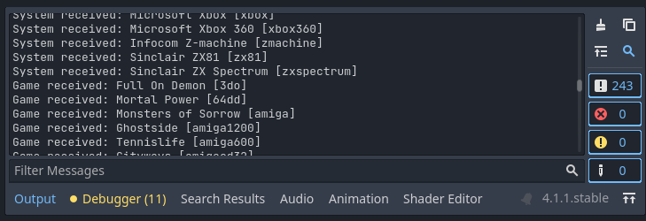

System & Game Data
==================

RetroHub shares information through data classes. There are two main ones you'll be working with: ``RetroHubSystemData`` for system information, and ``RetroHubGameData`` for game data. These arrive from ``system_received`` and ``game_received`` signals respectively.

If you look at the ``Logic.gd`` script, you'll notice there's some code for reading info from these data classes::

	## Called when RetroHub has information of a game system available.
	## It's entirely up to you how to display that system information.
	## RetroHub only sends information from systems with detected games.
	##
	## System information always arrives before game information.
	func _on_system_received(data: RetroHubSystemData):
		print("System received: %s [%s]" % [data.fullname, data.name])
	
	## Called when RetroHub has information of a game available.
	## It's entirely up to you how to display that game information.
	##
	## Game information always arrives after system information.
	func _on_game_received(data: RetroHubGameData):
		print("Game received: %s [%s]" % [data.name, data.system.name])

You should check these classes' definitions, either in app or from the API reference. You'll be using fields from it constantly to present information to the user.

If you run the project now, however, no information will be received. This is because the theme helper settings are set by default to not have any information available, i.e. the user has an empty library.

Change the settings (**RetroHub > Games**) to **Random**, and set the number of games per system to **1**. This setting will use real system data, but generate random game information. That way you can test for every system available without requiring you to own games for each system.

Run the project now and you'll notice you get some text output with information now. If you want to check each data class, you can breakpoint on each method and analyze the content of the data classes.

These two data classes are the most important. In this next section, we'll learn how to use them and how to present their information to the user through a simple UI.

.. note::
	From now on, the tutorial will assume this setting is set to **Random**. However, if you have your own gaming library already, you can set to **Local** instead to test the theme with your gaming library.