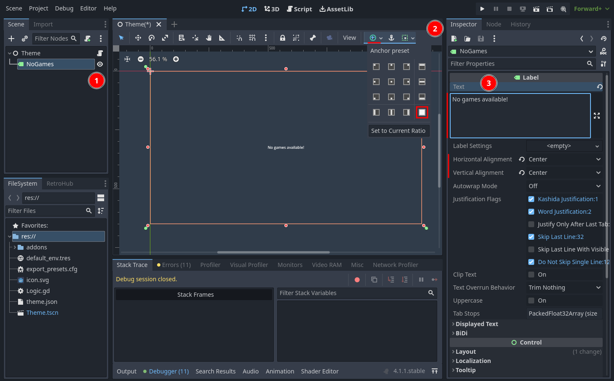
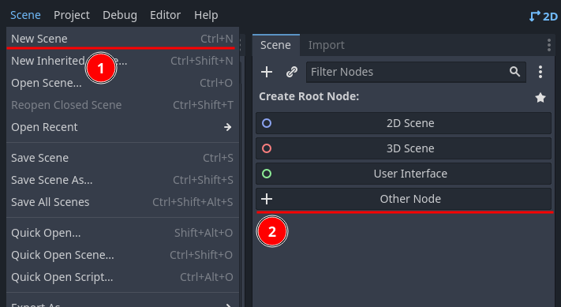
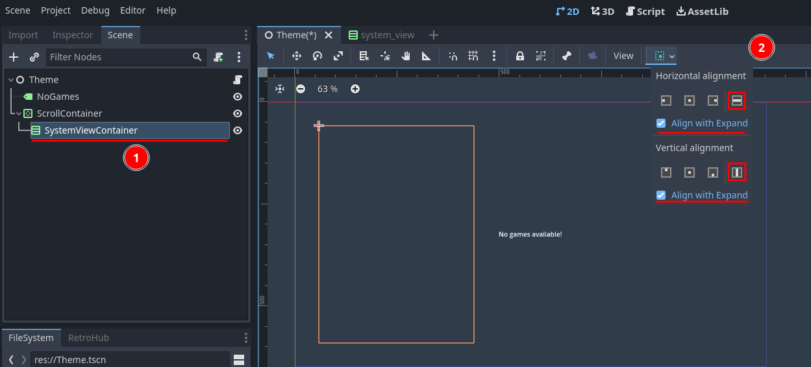

Building UI
===========

Now that we have system and game information, it's time to parse them and present to the user.

This is the part where themes will massively diverge. How you present this information to the user is entirely up to you. You can create a UI dropdown list for the user to select a game. Or `create a pretty retro console style selection screen <https://www.youtube.com/watch?v=vMULMb0CpLI>`_. Or `spawn a 3D cartridge object the user has to insert in a console <https://www.youtube.com/watch?v=SF8W8DTUEMs>`_. Or you can make `a DOOM clone where you shoot the game to launch it <https://github.com/orsonteodoro/psdoom-ng>`_. The possibilites are endless!

For this tutorial, we will make a simple UI where games are grouped by system, and the user can view some game metadata before launching it.

Handling empty libraries
------------------------

Before we begin, we have to ensure we handle an edge case properly; the user might not have any game available. In that instance, RetroHub will never send system/game data.

So, we can have our scene show by default a message for when no games are available, and remove it as soon as system/game data is received.

Add a new **Label** to the theme, called **NoGames**. Set it's layout to fill the entire screen, center the content, and write the warning message, such as "No games available!"

This is enough to warn the user. Ensure this is what appears if you try running the project with the theme helper settings games setting to **None**.

Creating system views
---------------------

Let's start by properly showing each system name. Let's create a new scene called ``system_view.tscn``, inheriting from **VBoxContainer**:

.. image:: assets/04-systemview_new_vbox.png

Set it's layout to fill the entire screen as well.

For now we will just show each system full name. Add a label to it called **SystemName**, set it's **Autowrap** property to **Word**, and leave it empty (the content will be changed in code).

Now add a script to the root **SystemView**, which will be called **system_view.gd**. Let's add a way for easily setting the system name from outside this scene:

.. code-block:: gdscript

	extends VBoxContainer

	@onready var system_name_label := $SystemName

	var system_data : RetroHubSystemData:
		set(value):
			system_data = value

	func _ready():
		system_name_label.text = system_data.fullname

Now, we need to instance this object at runtime when each system is received. Go back to ``Theme.tscn``. We may need to instance a lot of scene views and we want them to be presented neatly. For that we're gonna create a **VBoxContainer** to add them vertically, and a **ScrollContainer** to create scroll bars if the content doesn't fit on screen.

Start with the **ScrollContainer**, and give it a good amount of vertical size, while only occupying horizontaly about 30% of the screen, to leave space for game metadata later on.

Then add a **VBoxContainer** to it. Rename it to **SystemViewContainer** so it can be accessed in the script. Lastly, set it's size flags to expand so it occupies all the space the scroll container provides.

Now, edit the script under the **Theme** root node. Add references to the nodes we need: the **NoGames** label so we can remove it when there's content, and the **SystemViewContainer** to add **SystemView** instances to it:

.. code-block:: gdscript

	extends Node

	@onready var no_games_label := $NoGames
	@onready var system_view_container := $ScrollContainer/SystemViewContainer

	# _ready function, called everytime the theme is loaded, and only once
	func _ready():
		# App related signals
		RetroHub.app_initializing.connect(_on_app_initializing)
		...

Then move to the existing ``_on_system_receive_start`` function. This function is called right before RetroHub starts sending all system data, so it's the perfect place to remove our **NoGames** label:

.. code-block:: gdscript

	## Called when RetroHub is about to send all system data.
	func _on_system_receive_start():
		no_games_label.queue_free()

Now, let's start creating our **SystemView** instances. Edit the ``_on_system_received`` function right below:

.. code-block:: gdscript

	## Called when RetroHub has information of a game system available.
	## It's entirely up to you how to display that system information.
	## RetroHub only sends information from systems with detected games.
	##
	## System information always arrives before game information.
	func _on_system_received(data: RetroHubSystemData):
		var system_view = preload("res://system_view.tscn").instance()
		system_view.system_data = data
		system_view_container.add_child(system_view)

Go ahead and run your project. You'll now see a list of system "pretty names". The warning label about an empty library is gone as well.

Creating game entries
---------------------

We have a scene that handles system information. So, we can have it also handle any game data from that system. Let's make it so that each game data shows up as a button under each system name.

Create a new scene called **game_entry.tscn**, this time inheriting from a **Button**.

Add a script to it, which will be called **game_entry.gd**. The process is similar to what we did in the system view; we receive data, and set the label to some information:

.. code-block:: gdscript

	extends Button

	var game_data : RetroHubGameData:
		set(value):
			game_data = value

	func _ready():
			text = game_data.name

Let's prepare the **SystemView** scene to properly handle **GameEntry** instances. Add a **HFlowContainer** after the **SystemName** label, and rename it to **GameEntryContainer**. This container looks better when rearranging children with different sizes, which happens as games have titles with different lengths.

Now, instead of instancing game entries from the **Theme.tscn** like we did for system views, we'll do a trick so our code is more organized. RetroHub works by connecting to signals, and the main **Logic.gd** script connects to all of them; but that doesn't mean we can't connect from other places! So, let's connect to the ``game_received`` signal in our **SceneView.gd** instead, and instance the game entries there:

.. code-block:: gdscript

	extends VBoxContainer

	@onready var system_name_label := $SystemName
	@onready var game_entry_container := $GameEntryContainer

	var system_data : RetroHubSystemData:
		set(value):
			system_data = value

	func _ready():
		system_name_label.text = system_data.fullname
		RetroHub.game_received.connect(_on_game_received)

	func _on_game_received(game_data: RetroHubGameData):
		if game_data.system == system_data:
			var game_entry = preload("res://game_entry.tscn").instantiate()
			game_entry.game_data = game_data
			game_entry_container.add_child(game_entry)

Every game data keeps a reference of the system it comes from, so you can use this to check whether this game data belongs to the current system view.

If you now run the project, you'll now see buttons below each system name, with each game title. Try increasing the amount of games received to 5 or more, and see how the buttons get rearranged!

We are very close to having a theme that can launch games already! We could do it right now with the right API call, but let's wait until next section to create the metadata viewer, so we have a proper UI element for launching games.

.. warning::
	Don't forget that the base code connects to the ``game_received`` signal from **Logic.gd** and prints each game name for debugging purposes. As we now have a proper way to handle game data, you can now remove that connection to stop getting all that output data to the console.