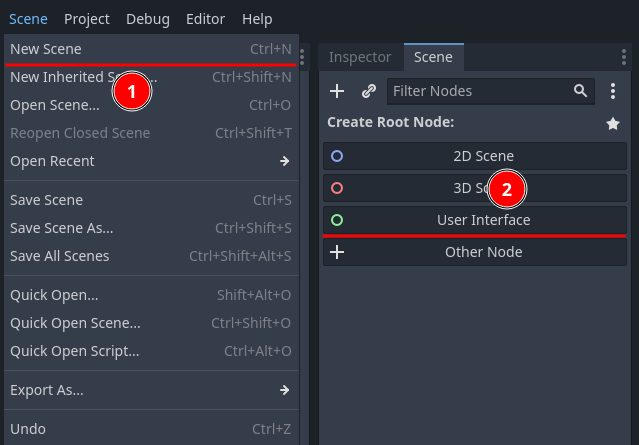
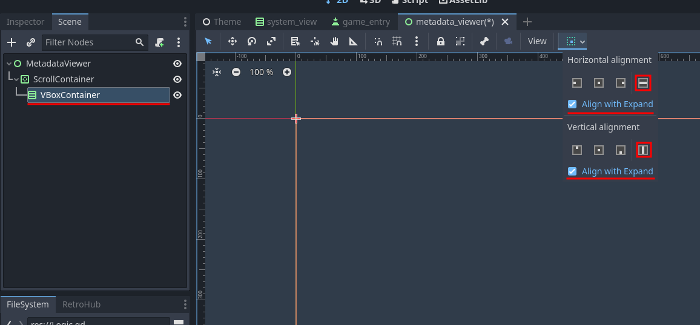
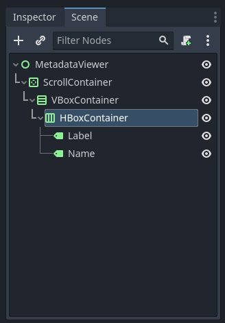
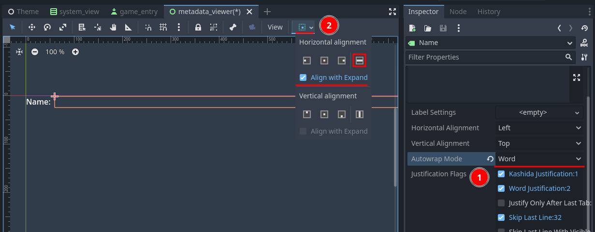
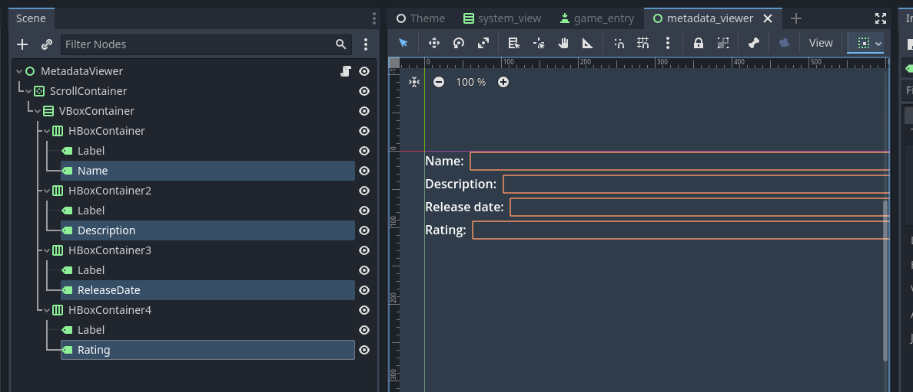
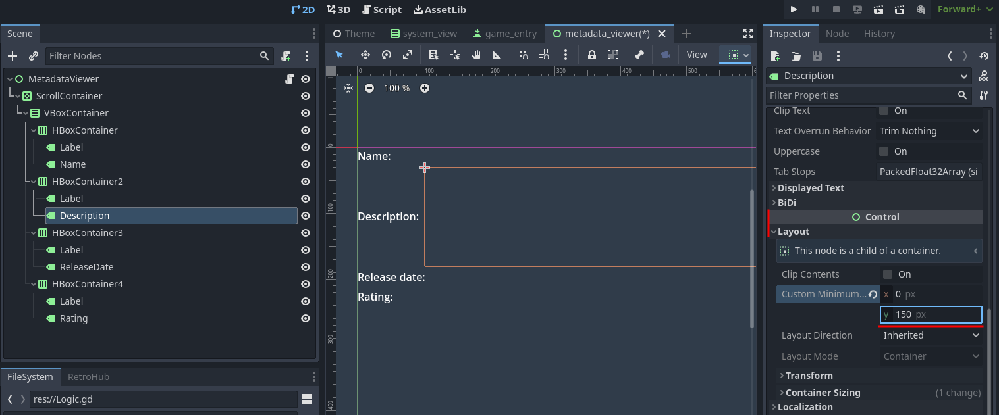
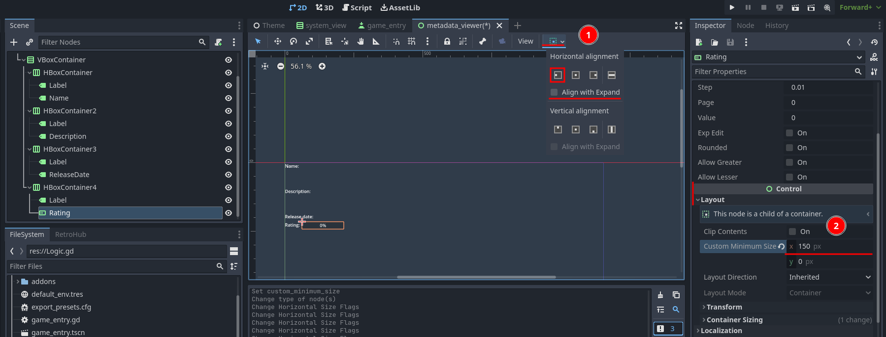
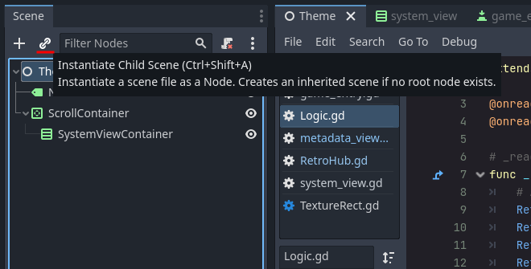
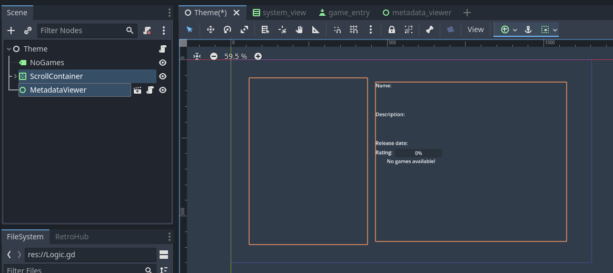

Presenting metadata
===================

We built a simple UI, but it's already showing games for the user to pick and launch. Let's make it more complete by showing information about the game, such as title, description, and rating, when the user picks them.

Creating metadata viewer
------------------------

Let's create a new scene, called **MetadataViewer.tscn**. Make it inherit from **User Interface** (*aka* **Control**); this node will be added to the main theme, so there's no need to handle layout in this scenario.

Similarly to what we did for system views, let's add a **ScrollContainer** to add scroll bars if the content doesn't fit on screen. Add a **ScrollContainer**, set it's layout to **Full Rect**, and set both size flags to **Expand** as well.

We will have multiple objects inside this container, so add a **VBoxContainer** to order them vertically. Set both size flags to **Expand** as well.

Now we start Building the UI for showing all the information we want. ``RetroHubGameData`` has plenty of variables available, and because building an UI for all of them is time-consuming, we will just focus on a few of them: name, description, release date and rating.

Creating a name field
---------------------

Let's start by building a base structure for showing the name. We can then duplicate if for the other fields and change each structure a bit for speeding up this process.

Create a **HBoxContainer**, and inside it create two labels: **Label** (you can leave the default name) and **Name** (it's this one we will change in code). Set the horizontal size flag of the **HBoxContainer** to **Expand** as well.

The **Label** will just describe the name of this field, so set it's content to ``Name:`` (add a space at the end so the text next to it isn't "glued" to the left).

.. image:: assets/05-creatingmetadata_namelabel.png

The **Name** label will be left empty, as it will be set in code. However we need to change some settings. Enable **Autowrap** to prevent very long lines of text making this label huge. To ensure it has horizontal space available, set the horizontal size flag to **Expand** as well.

Now would be a good idea to test this before moving on. It's going to take a bit of work to connect this scene to the theme in the end, so we'll cheat for now by generating a random game data in here, and using it instead.

Create the script at the root **MetadataViewer** object, which will be called **MetadataViewer.gd**. We add the nodes we're interested in editing, and change them when game data arrives:

.. code-block:: gdscript

	extends Control

	# Nodes to edit
	onready var name_label := $ScrollContainer/VBoxContainer/HBoxContainer/Name

	# Game data to display
	var game_data : RetroHubGameData setget set_game_data

	func set_game_data(_game_data: RetroHubGameData):
		game_data = _game_data

		# Edit our nodes as soon as data is received
		name_label.text = game_data.name

	func _ready():
		# Debug: Generate a random game data for now.
		# System data is used internally, so in this case it's alright to set to null
		var random_data = RetroHub.gen_random_game(null)
		set_game_data(random_data)

You should now run this scene instead of the whole project. Check that there is a name present when you run it.

Showing the remaining content
-----------------------------

Our name object works perfectly! Let's go ahead and create the remaining fields: description, release date and rating.

Duplicate the **HBoxContainer** 3 times, so you get 4 nodes in the end. Go to each **Label** and change the name accordingly, and rename **Name** to each field name.

Now let's go through each field which needs some tweaking.

Description
~~~~~~~~~~~

Descriptions are very likely to contain a lot of text. We can increase it's vertical size a bit to reflect that. Set the minimum vertical size to **150** pixels.

Rating
~~~~~~

Rating will be a value between 0 and 1. So it makes more sense to show this information differently. Change the **Rating** node type to be a **ProgressBar** instead. Because it has the size flag set to expand, it occupies the full wdith, which looks ugly. Uncheck that option in this node, and set a minimum horizontal size of **150** pixels.

Now, we can add the new nodes to our script to show all the information:

.. code-block:: gdscript

	extends Control

	# Nodes to edit
	onready var name_label := $ScrollContainer/VBoxContainer/HBoxContainer/Name
	onready var description_label := $ScrollContainer/VBoxContainer/HBoxContainer2/Description
	onready var release_date_label := $ScrollContainer/VBoxContainer/HBoxContainer3/ReleaseDate
	onready var rating_progress_bar := $ScrollContainer/VBoxContainer/HBoxContainer4/Rating

	# Game data to display
	var game_data : RetroHubGameData setget set_game_data

	func set_game_data(_game_data: RetroHubGameData):
		game_data = _game_data

		# Edit our nodes as soon as data is received
		name_label.text = game_data.name
		description_label.text = game_data.description
		release_date_label.text = game_data.release_date
		rating_progress_bar.value = game_data.rating * 100

	func _ready():
		# Debug: Generate a random game data for now. System name is irrelevant
		var random_data = RetroHub.gen_random_game("nes")
		set_game_data(random_data)

Run the scene and you'll see all the new information displaying properly. Try resizing the window and check that the content resizes properly.

.. image:: assets/05-creatingmetadata_dataresult.png

Connecting everything up
------------------------

Now that we can successfully show game metadata, we need to add it to our main scene, and give it data to show. This last step will be a bit tricky, because the objects with all the game data are our game entries. They can't access the metadata viewer directly, so we'll have to change some things in the code to support this.

Firstly, let's add it to our main scene, which is the easy part. Open the main **Theme.tscn**, and instance our scene through **Instance Child Scene**.

Resize the object so it only occupies the right portion of the screen. Remember not to overlap with the system view.

Now it's time to connect this is code so it receives metadata to show. Recall that **SystemView** instances **GameEntry** children, and each entry is assigned it's own game data. Each button has a ``pressed`` signal whenever it's pressed, which we need to use anyways. One solution we have is to use the ``pressed`` signal itself to transport each button's game data (in Godot, each signal can have extra variables if nedded). Edit **SystemView.gd**:

.. code-block:: gdscript

	...
	func _on_game_received(game_data: RetroHubGameData):
		if game_data.system == system_data:
			var game_entry = preload("res://GameEntry.tscn").instance()
			game_entry.game_data = game_data
			game_entry_container.add_child(game_entry)
			game_entry.connect("pressed", self, "_on_game_entry_pressed", [game_entry.game_data])

	func _on_game_entry_pressed(game_data: RetroHubGameData):
		# TODO
		pass

We now have a way to check when a button is pressed, and know what game data it has. However, we still can't access the **MetadataViewer** object from the **SystemView** code, so let's propagate this signal further. Create a new custom ``game_selected`` signal, and emit it when any game entry button is pressed:

.. code-block:: gdscript

	extends VBoxContainer

	signal game_selected(game_data)

	onready var system_name_label := $SystemName
	onready var game_entry_container := $GameEntryContainer
	
	...

	func _on_game_entry_pressed(game_data: RetroHubGameData):
		emit_signal("game_selected", game_data)

Alright, that takes care of the problem! **SystemView** now has a signal which will be triggered whenever an entry is pressed, and it exposes that entry's game data. We can now connect to this signal from our root **Theme** scene, although we need to do it in code as we're creating **SystemView** instances in runtime. Edit **Logic.gd**:

.. code-block:: gdscript

	...
	func _on_system_received(data: RetroHubSystemData):
		var system_view = preload("res://SystemView.tscn").instance()
		system_view.system_data = data
		system_view.connect("game_selected", self, "_on_game_selected")
		system_view_container.add_child(system_view)

	## Called when a game entry is selected by the user
	func _on_game_selected(game_data: RetroHubGameData):
		pass

We're nearly there! All we need to do now is get a reference to the **MetadataViewer** child, and then pass the game data onto it:

.. code-block:: gdscript

	extends Node

	onready var no_games_label := $NoGames
	onready var system_view_container := $ScrollContainer/SystemViewContainer
	onready var metadata_viewer := $MetadataViewer

	# _ready function, called everytime the theme is loaded, and only once
	func _ready():
		# App related signals
		RetroHub.connect("app_initializing", self, "_on_app_initializing")
		...
	
	...

	## Called when a game entry is selected by the user
	func _on_game_selected(game_data: RetroHubGameData):
		metadata_viewer.game_data = game_data

Now we are finally done! Run the project now, and click on the game entries. The metadata will change accordingly to show that entry's information!

Don't forget to remove the ``_ready`` function from **MetadataViewer** which generated random games for testing!

Launching games
---------------

Now that we can properly display game information, we're ready to let RetroHub know the user has selected a given game, and wants to launch it.

Games must be selected before launching. This is to allow the user to select a game and potentially edit it's metadata or scrape it for information from the main app.

We already have a system in place to know which game entry was selected, so we use it to signal RetroHub. Edit ``Logic.gd``:

.. code-block:: gdscript

	...
	## Called when a game entry is selected by the user
	func _on_game_selected(game_data: RetroHubGameData):
		metadata_viewer.game_data = game_data
		RetroHub.set_curr_game_data(game_data)

Now, we need to launch the game. If we used the current game entry buttons to do that though, the user would never have the chance of viewing the game information before launching it. So, let's create a new **Button** just for that.

Move it to the right-bottom corner and give it an appropriate label, such as "Launch Game". We need to have it be disabled by default: when the app launches, no game data is selected, so if the button was active, the user could try to launch a "null" game data, which would cause problems.

Time to code it's behavior. Let's make it pressable when a game entry is selected:

.. code-block:: gdscript

	extends Node

	onready var no_games_label := $NoGames
	onready var system_view_container := $ScrollContainer/SystemViewContainer
	onready var metadata_viewer := $MetadataViewer
	onready var launch_button := $Launch

	...

	## Called when a game entry is selected by the user
	func _on_game_selected(game_data: RetroHubGameData):
		metadata_viewer.game_data = game_data
		RetroHub.set_curr_game_data(game_data)
		launch_button.disabled = false

Since this button is added to the scene, we can connect to the ``pressed`` signal from the editor. Ensure it will add the method to the root **Theme** node.

Now it's just a matter of asking RetroHub to launch the currently selected game data:

.. code-block:: gdscript

	## Called when the launch button is pressed
	func _on_Launch_pressed():
		RetroHub.launch_game()

You can run the project now, and try launching a game. You'll see that no game will actually launch (this is random data anyways; sorry, I know you wanted to find out what "Roads and Spaceflight" was about), but if you look at the console output, you'll see messages indicating that a game is launched. This means everything is working; if this theme was running under RetroHub right now, it would launch the game!

Before exporting our theme to the final app, however, let's spice things up with some game media in the next section.