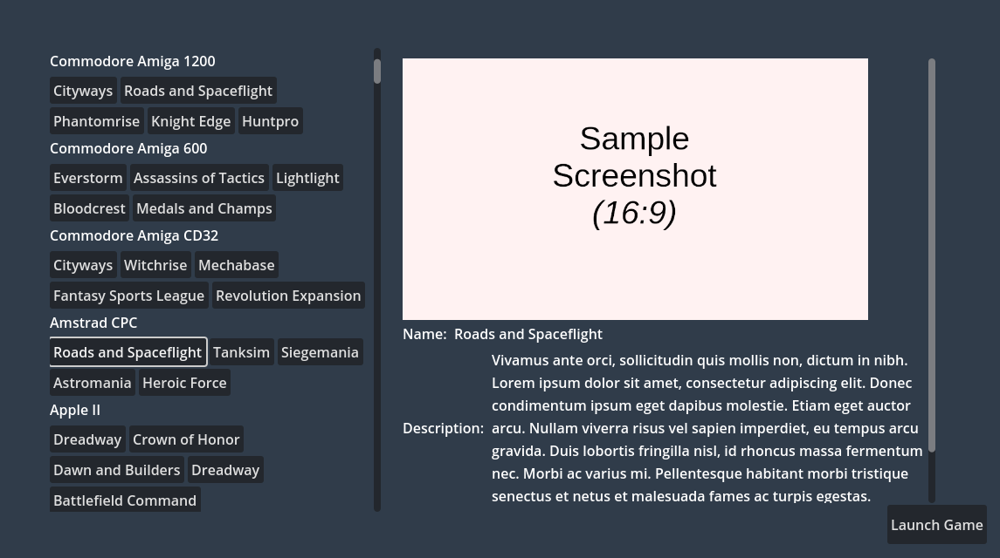

Showing game media
==================

We have a functioning theme so far, but it's still too dull, as we're only showing text information.

Games might have some media to show, such as a title screen, game logo, or a short gameplay video. There's even more media for more complex usages, such as box and physical support textures!

Let's change our **MetadataViewer** to show a game's screenshot along the current text info.

Receiving game media data
-------------------------

Contrary to system and game data, media data has to be requested from RetroHub. While system and game data's are "cheap" to instance and have in memory, loading all the existing media would quickly eat all the user's memory. In our case it's also wasteful, since we only want to show media for the currently selected game.

Let's implement this behavior inside **MetadataViewer**. Open **metadata_viewer.gd** and request media, if available:

.. code-block:: gdscript

	# Media data to display
	var media_data : RetroHubGameMediaData

	# Game data to display
	var game_data : RetroHubGameData:
		set(value):
			game_data = value
			
			# Edit our nodes as soon as data is received
			name_label.text = game_data.name
			description_label.text = game_data.description
			release_date_label.text = RegionUtils.localize_date(game_data.release_date)
			rating_progress_bar.value = game_data.rating * 100

			# If media is available, show it as well
			if game_data.has_media:
				media_data = RetroHubMedia.retrieve_media_data(game_data)

.. note::
	The reason why ``media_data`` is global, instead of a local variable inside each game entry, is to ensure the old media data will be deleted when it changes to something else. Media data is expensive to have in memory, so you have to take extra care to ensure it's properly deleted when it's not needed anymore.

To show a screenshot, the media data provides an **ImageTexture** resource. Let's add a node suitable for it. Right before the first name property (**HBoxContainer**), add a **TextureRect** node. Images may come in all sizes, so set the **Expand Mode** to **Ignore Size** to force the image to be scaled (preventing extremely large or small pictures). Additionally, images may have different aspect ratios (4:3 vs 16:9 games, for example), so set it's **Stretch Mode** to **Keep Aspect** to respect it. Lastly, because we now control the image size, set a minimum height of **300** pixels.

Rename the node to **Screenshot**, add it to **metadata_viewer.gd** and set it's texture value when the requested type of media exists:

.. code-block:: gdscript

	# Nodes to edit
	@onready var name_label := $ScrollContainer/VBoxContainer/HBoxContainer/Name
	@onready var description_label := $ScrollContainer/VBoxContainer/HBoxContainer2/Description
	@onready var release_date_label := $ScrollContainer/VBoxContainer/HBoxContainer3/ReleaseDate
	@onready var rating_progress_bar := $ScrollContainer/VBoxContainer/HBoxContainer4/Rating
	@onready var screenshot_texture_rect := $ScrollContainer/VBoxContainer/Screenshot
	...

	# Game data to display
	var game_data : RetroHubGameData:
		set(value):
			...

			# If media is available, show it as well
			if game_data.has_media:
				media_data = RetroHubMedia.retrieve_media_data(game_data)
				if media_data.screenshot:
					screenshot_texture_rect.texture = media_data.screenshot

Lastly, we need to take into account game entries that don't have media to show. If that's the case, the image will be empty but still taking space, which looks bad. We can hide it when there's no media available:

.. code-block:: gdscript

	# Game data to display
	var game_data : RetroHubGameData:
		set(value):
			...

			# If media is available, show it as well
			if game_data.has_media:
				media_data = RetroHubMedia.retrieve_media_data(game_data)
				if media_data.screenshot:
					screenshot_texture_rect.visible = true
					screenshot_texture_rect.texture = media_data.screenshot
				else:
					screenshot_texture_rect.visible = false
			else:
				screenshot_texture_rect.visible = false

And also hide the node by default:

Run the project now, and you'll see a sample screenshot when selecting game entries; some in 4:3, some in 16:9.

Supporting other types of media is very straightforward, as most of them are **ImageTexture** resources as well. More advanced cases such as video and box/support textures are explained in other sections if you want to explore them.

Our theme is ready now! Now, we just need to export it to be used in RetroHub, which we'll do in the next, and final, section!