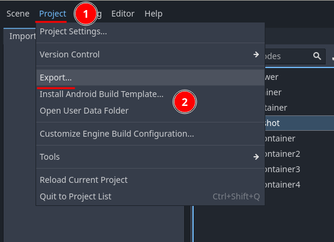
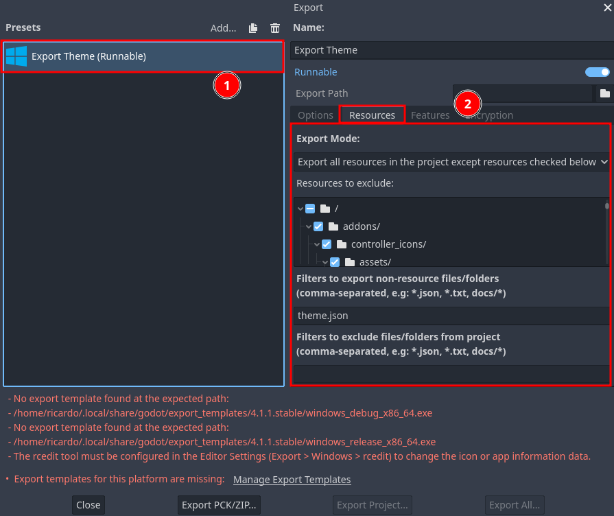

.. include:: /global/rh_links.rst

Exporting theme
===============

With the theme fully ready, it's time to export it to be used in RetroHub. This is pretty simple and your theme should behave almost exactly the same way afterwards.

Exporting
---------

To export a theme, you'll export it like it's a regular Godot project. The difference is you're not going to export a final executable; instead, you'll export it in a PCK format, an "archive" which Godot can load at runtime.

Open the export dialog by going to **Project** > **Export...**

Select any **Sample Export** preset available you want; it's indifferent as the exported project is cross-platform and will run on any major OS.

Open the **Resources** tab and ensure the settings are set properly:

- **Export Mode:** Export all resources in the project
- **Filter to export non-resource files/folders:** Add ``theme.json``. This is the file read by RetroHub with information about your theme (all the info from the **RetroHub** tab)
- **Filter to exclude non-resource files/folders:** Add ``addons/retrohub_theme_helper, addons/controller_icons``. These are the addons RetroHub already ships with, so you can remove them to save space. `retrohub_theme_helper` is just a helper addon, so it has to be removed on exporting, otherwise it conflicts with RetroHub's files.

Finally, you can export your theme by clicking at **Export PCK/Zip...**.

.. note::
	You need to export in the PCK format, as it's the only one RetroHub currently supports.

.. warning::
	You need to have export templates installed to be able to export PCK files. These are completely unnecessary for exporting, but Godot won't let you proceed until you have them installed.

	This has been `notified <https://github.com/godotengine/godot/issues/64748>`_ and hopefully will no longer be an issue in the upcoming 3.6 version.

Testing
-------

To test your theme, drop the exported theme in RetroHub's theme folder, and :ref:`open it in the app <user_guide_setup_themes_installing>`.

Conclusion
----------

Congratulations on creating your first theme! To make this tutorial short and to the point, the final theme ended up being pretty barebones, but by this point you've certainly noticed that all the implementation details are up to you as a theme developer, and that you'll have a lot of freedom on how to create themes.

For more in-depth guidance, check the remaining :ref:`help pages <theme_development>`, and for any questions, suggestions, or just showcasing your work, join us at |rh_discord| and |rh_reddit|.