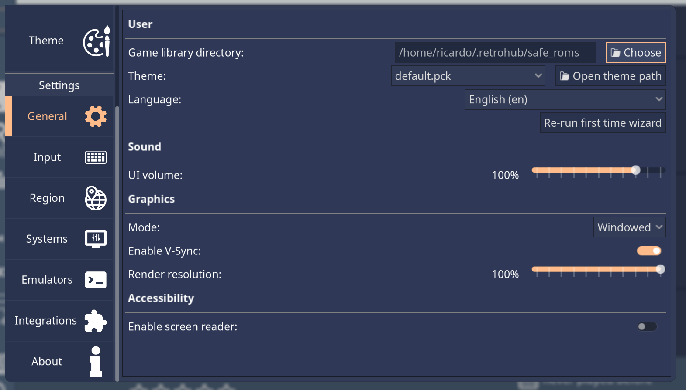
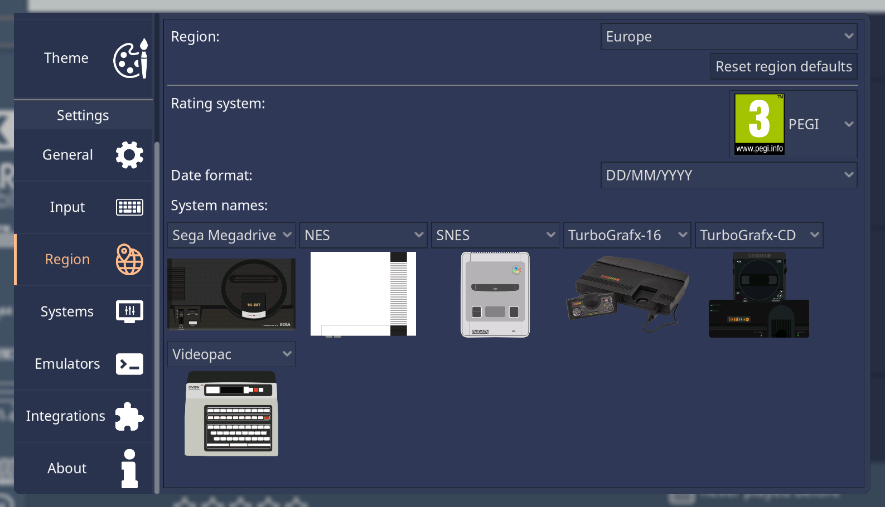

Configuration
=============

Even though RetroHub is designed with minimal configuration necessary, there's plenty of options available to further customize it to your liking. This page covers all available configurations.

General
-------

User
^^^^
- **Game library directory**: The directory where your games are stored.

.. warning::
	If you change this, RetroHub will not move the existing games to the new directory. You will have to do that manually.

- **Theme**: Currently loaded theme
- **Language**: App language
- **Re-run first time wizard**: Re-run the first time wizard

Graphics
^^^^^^^^
- **Mode**: Windowed or fullscreen
- **Enable V-Sync**: Enable V-Sync
- **Render resolution**: Resolution to render the theme at. Main UI is not affected.

Accessibility
^^^^^^^^^^^^^

- **Enable screen reader**: Enables a screen reader to read the interface out loud.

Input
-----

Check the dedicated :ref:`userguide_input` page.

Region
------

- **Region**: User region; has no impact whatsoever on what games can be played.
	- **Reset region defaults**: Resets the other settings to the default according to the selected region.
- **Rating system**: Rating system to use for games: ESRB, PEGI or CERO.
- **Date Format**: Date format to present dates in.
- **System Names**: Preferred system names for systems with different names per region.

.. note::
	If you have games on two system folders that are the same but have different names per region (e.g. ``genesis`` and ``megadrive``), RetroHub will combine both games and show under the preferred system name. Likewise, if you change the region system name, you don't need to move files in your library.

Systems
-------

Check the dedicated :ref:`userguide_systems` page.

Emulators
---------

Check the dedicated :ref:`userguide_emulators` page.
