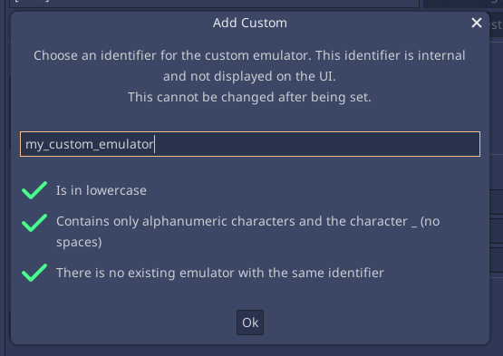
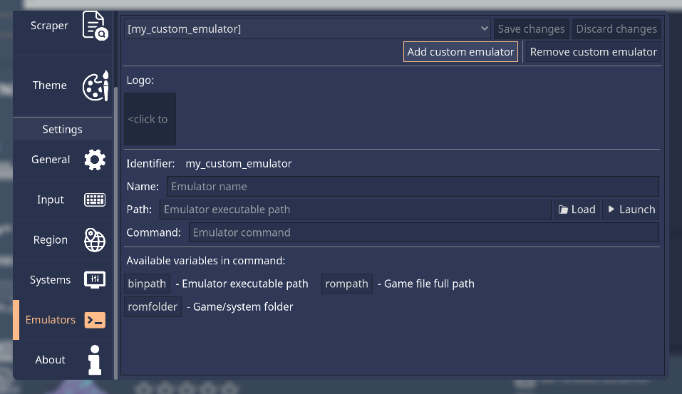

.. include:: /global/rh_actions.rst

Adding custom emulators
=======================

There are two ways to achieve this:

Application
-----------

Open the Configuration UI (|action: rh_menu|), and navigate to the **Emulators** section. Click on the ``Add custom emulator``.

This will bring a popup to choose a short emulator name. This is what's used internally to uniquely identify the emulator.

It must follow the following rules to be valid:

- Be lowercase
- Use only alphanumeric characters (a-z and 0-9) and the underscore character
- Not be an existing emulator short name

After that you must now set all the information relevant to that emulator in each available field, such as it's name, executable path, and command to run.

For the command, you can use variables as placeholders, such as the emulator's path and the game file location. Use the existing buttons to place them, or write them manually in the form of "{variable_name}". The available variables are:

- ``{binpath}``: The emulator's executable path
- ``{rompath}``: The full game file path

.. note::
	Don't forget that paths may have spaces. Surround variables with quotes ``"`` to avoid issues.

Manually
--------

Edit the ``rh_emulators.json`` file in the configuration directory. Add a dictionary entry to the existing array, with the emulator information:

.. code-block:: json

	[
		{
			"name": "my_custom_emulator",
			"fullname": "My Custom Emulator",
			"binpath": "/path/to/emulator",
			"command": "{binpath} -e \"{rompath}\""
		}
	]

For more information on the necessary keys and their values, see the :ref:`emulators_spec` section.