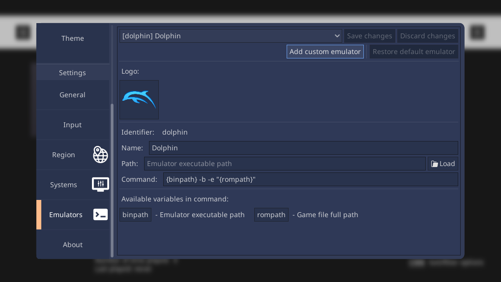

.. include:: /global/rh_actions.rst

Changing emulator settings
==========================

There are two ways to achieve this:

Application
-----------

Open the Configuration UI (|action: rh_menu|), and navigate to the **Emulators** section.

Then modify these fields to your liking. Remember to save changes when you're done.

You can also revert to the default settings by clicking the **Restore default emulator** button.

Manually
--------

Edit the ``rh_emulators.json`` file in the configuration directory. Add a dictionary entry to the existing array, with the ``name`` field set to the name of the emulator you want to modify, and then changing the other key values:

.. code-block:: json

	[
		{
			"name": "mupen64plus",
			"fullname": "Mupen64Plus (Bleeding Edge)",
			"binpath": "/bin/mupen64plus-custom"
		}
	]

For more information on the existing keys and their values, see the :ref:`emulators_spec` section.