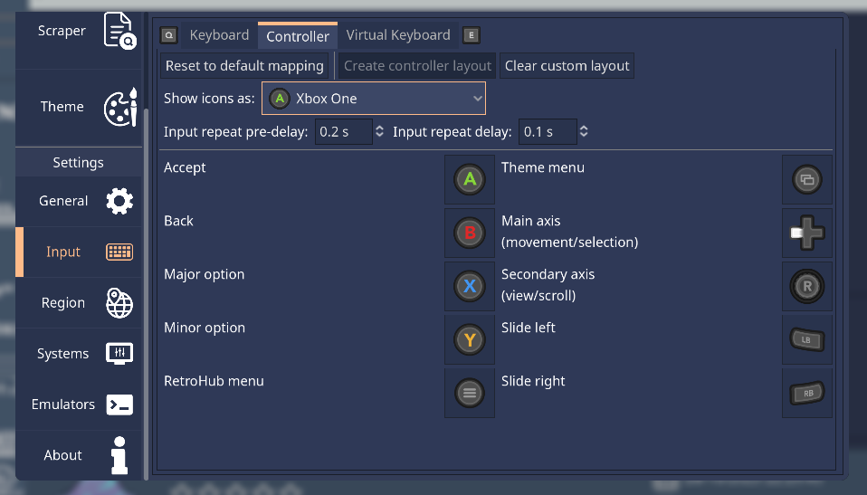
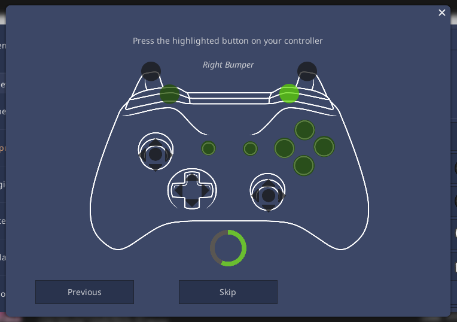
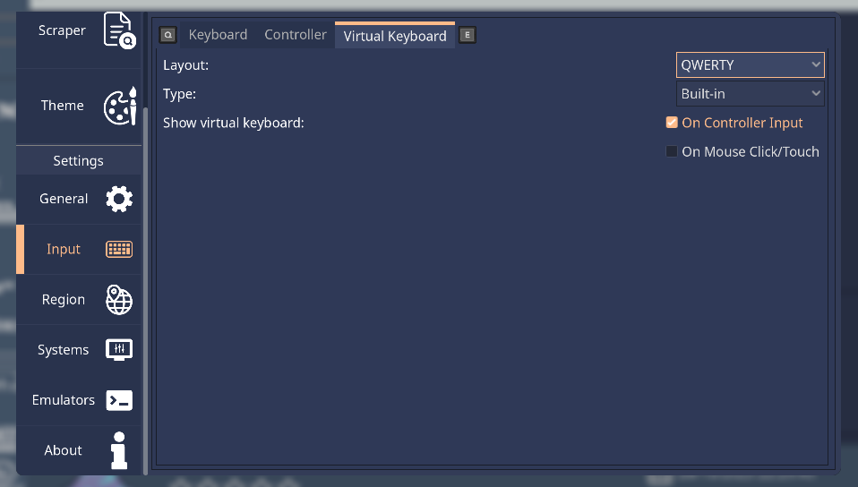

.. include:: /global/rh_actions.rst
.. _userguide_input:

Input Methods
=============

RetroHub has full support for keyboard, mouse and controller input. You can use one or all input methods seamlessly throughout the app.

Keyboard
--------

You can remap actions to different keys. Click on the desired action, then press the new key to use on that action.

.. note::
	It's normal if the displayed icon and text don't match. That's because RetroHub uses the "physical" key location on the keyboard, independent of your keyboard layout.

.. note::
	You can't use the same key for more than one action. If you try to remap a key to an existing action, they will be swapped.

Controller
----------

RetroHub should detect your controller automatically once it's plugged in. If detected successfully, it will also show appropriate icons for your controller model.

You can remap buttons and axis to other alternatives. Click on the desired action, then choose the new button/axis to replace to. If that button/axis is used on another action, they are swapped.

.. image:: assets/controller_remap.png

Beyond remapping, there are some more settings for customizing the controller's behavior:

- **Create controller layout**: Create a custom layout for your controller if it's not behaving correctly. See `Controller Layouts`_ for more details.
- **Clear custom layout**: Clear the custom layout for your controller. This will revert to the default layout.
- **Show icons as**: Choose what icons to display for your controller. If automatic detection doesn't work, you can manually set your controller type here.
- **Input repeat pre-delay**: The delay before the button/axis starts repeating when held down.
- **Input repeat delay**: The delay between each repeat event when held down.

.. _userguide_input_controller_layouts:

Controller Layouts
^^^^^^^^^^^^^^^^^^

If your controller is not behaving properly (such as buttons not doing anything or doing the wrong action), RetroHub is using a wrong layout for your controller.
In that case, you must create a controller layout for RetroHub to understand your controller inputs.

This will bring up a tool to map your controller buttons. Click or move on the highlighted buttons/axis as instructed to map it. If you do not have the specified button or if it doesn't work on your controller, you can skip it by clicking on the "Skip" button.

Virtual Keyboard
----------------

RetroHub comes with a virtual keyboard to input text when a physical keyboard isn't available.

- **Layout**: Virtual keyboard layout
- **Show virtual keyboard**:
	- **On Controller Input**: Show the virtual keyboard when a controller is used, and a text field is selected with |action-joy: rh_accept|.
	- **On Mouse Click/Touch**: Show the virtual keyboard when there's a mouse click or touch on a text field.