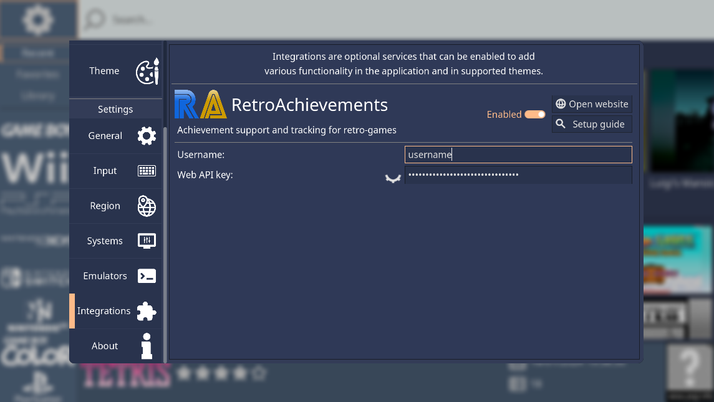
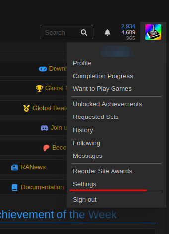
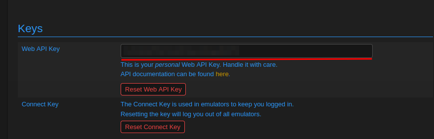

.. include:: /global/rh_actions.rst

RetroAchievements
=================

.. image:: /global/assets/integrations/retroachievements.png
	:width: 25%

`RetroAchievements <https://retroachievements.org/>`__ is a service that introduces achievements on classic systems, such as the SNES, Genesis, PlayStation, and many others. It also tracks your progression, statistics, and allows you to compete with other players.

RetroHub can fetch your personal achievement information and progression, providing it for supported themes.

.. image:: /global/assets/integrations/retroachievements_example.png

Setup
-----

.. warning::

	You must have a RetroAchievements account to use this integration. You can `sign up <https://retroachievements.org/>`__ for free.

	You also need to `setup your emulators properly <https://retroachievements.org/download.php>`__, and ensure your game files are supported by RetroAchievements.

Open the **Settings** (|action: rh_menu|) panel, and navigate to the **Integrations** section. Find the ``RetroAchievements`` section.

The integration must be enabled for themes to be able to use it. You must also fill in your RetroAchievements username and web API key.

The web API key can be found in your settings panel on the RetroAchievements website.

