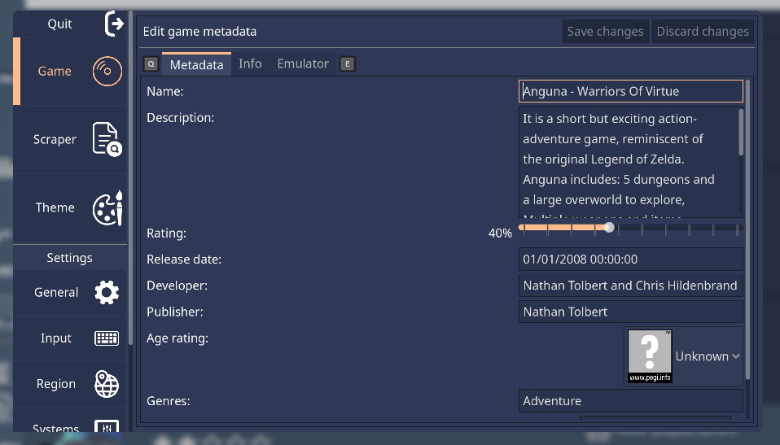
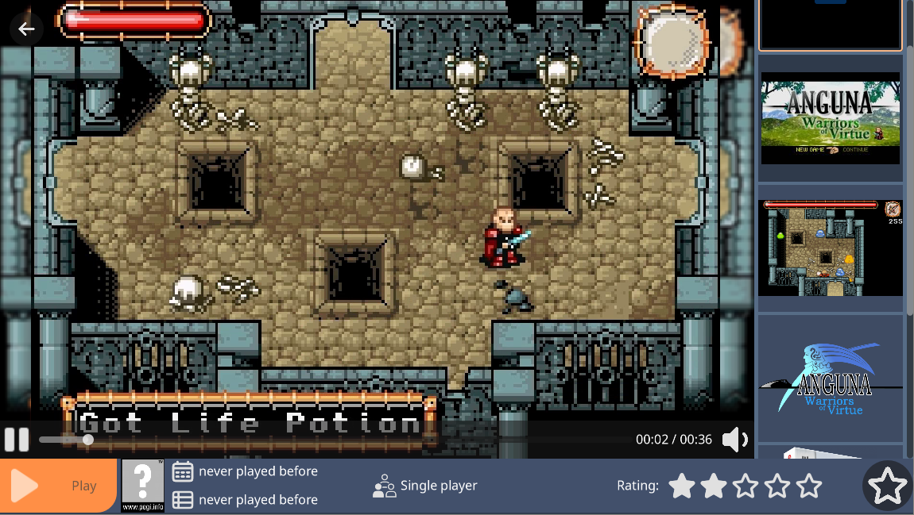

.. include:: /global/rh_actions.rst

Game metadata
=============

In this page, the metadata format is described, as well as a general description of how RetroHub handles your gaming library.

Gaming library setup
--------------------

RetroHub treats your gaming library as a read-only directory, to avoid potential troubles. Other than creating these folders for new systems, RetroHub cannot edit these game files, nor delete system folders.

The directory structure is as follows: a set of folders with short system names, with the games for the system placed inside it.

.. code-block:: none

	/path/to/your/library
	├── nes
	│   ├── game.rom
	│   ├── game.srm
	│   └── game.png
	├── pico8
	│   ├── game.rom
	│   ├── game.srm
	│   └── game.png
	└── c64
	    ├── game.rom
	    ├── game.srm
	    └── game.png

For that reason, RetroHub stores configuration files and metadata information in another directory:

- **Windows**: ``C:\Users\<username>\RetroHub``
- **macOS**: ``/Users/<username>/.retrohub``
- **Linux**: ``/home/<username>/.retrohub``

Adding metadata
---------------

When RetroHub finds a valid game file, it starts without any metadata. Only the name will be set to the file name. You can then populate a lot of information for the game, such as the name, description, release date, developer, publisher, genre, etc.

To do this, select a given game, then open the **Settings** (|action: rh_menu|) panel. The **Game** tab should be selected by default; if not, select the **Game** tab from the left.

Here you can edit your game's metadata. Don't forget to save changes when you're done.

Adding media
------------

Game entries may also have media to show. This can be a screenshot, a logo, a short gameplay video, a box texture, etc...

Due to the nature of media files, this has to be done outside of RetroHub. Suppose you have the game ``My Game [!].rom``, in the ``snes`` folder. To add media to it, you'll need to:

- Go to RetroHub's configuration directory (check above for the location)
- Go to the ``gamemedia`` folder
- Enter the ``snes`` folder (if it doesn't exist yet, create it)
- Create the appropriate media folder (see below)
- Add the media file, renamed to the game's name (for example, ``My Game [!].png``)

The available media files are the following:

+------------------+------------------------+---------------------+---------------------------------------------------------------------+
| Media            | Folder name            | File extension      | Description                                                         |
+==================+========================+=====================+=====================================================================+
| Logo             | logo                   | ``.png`` / ``.jpg`` | The game's logo (title art)                                         |
+------------------+------------------------+---------------------+---------------------------------------------------------------------+
| Screenshot       | screenshot             | ``.png`` / ``.jpg`` | A screenshot of the game                                            |
+------------------+------------------------+---------------------+---------------------------------------------------------------------+
| Title Screen     | title-screen           | ``.png`` / ``.jpg`` | A screenshot of the game's title screen                             |
+------------------+------------------------+---------------------+---------------------------------------------------------------------+
| Video            | video                  | ``.mp4``            | A short gameplay video                                              |
+------------------+------------------------+---------------------+---------------------------------------------------------------------+
| Box Render       | box-render             | ``.png`` / ``.jpg`` | A picture of the game's box                                         |
+------------------+------------------------+---------------------+---------------------------------------------------------------------+
| Box Texture      | box-texture            | ``.png`` / ``.jpg`` | The game's box as a texture, to be used for a 3D model              |
+------------------+------------------------+---------------------+---------------------------------------------------------------------+
| Support Render   | support-render         | ``.png`` / ``.jpg`` | A picture of the game's physical support (cartridge, CD, etc...)    |
+------------------+------------------------+---------------------+---------------------------------------------------------------------+
| Support Texture  | support-texture        | ``.png`` / ``.jpg`` | The game's physical support as a texture, to be used for a 3D model |
+------------------+------------------------+---------------------+---------------------------------------------------------------------+
| Manual           | manual                 | ``.pdf``            | The game's manual                                                   |
+------------------+------------------------+---------------------+---------------------------------------------------------------------+

.. warning::
	Currently, RetroHub cannot display manual files.

Filling game information automatically
--------------------------------------

Setting up metadata and media for your entire library is very time consuming. To accelerate this process, RetroHub can use scraper services that automatically fill most, it not all, information for you. Check the :ref:`userguide_scraping` page for more information on how to use them.