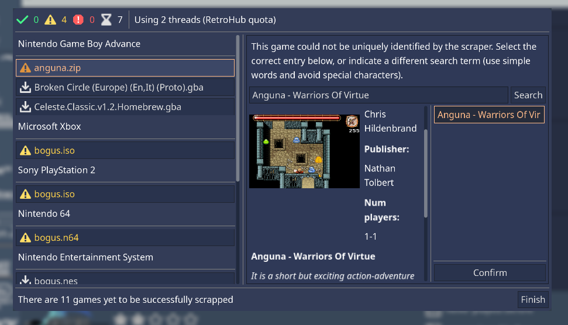
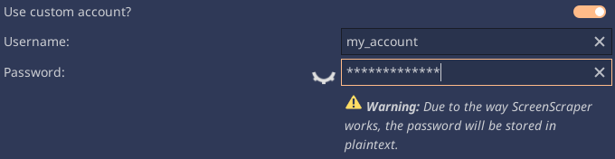

.. include:: /global/rh_actions.rst
.. _userguide_scraping:

Scraping
========

A scraper is a tool to automatically fill up game's metadata and media. RetroHub supports the following scrapers:

- `ScreenScraper <https://www.screenscraper.fr/>`_

Planned support for future scraper services:

- `TheGamesDB <https://thegamesdb.net/>`_
- `EmuMovies <https://www.emumovies.com/>`_

Usage
-----

.. note::
	It's recommended to use keyboard and mouse during the process.

You can scrape one, multiple, or even your entire library of games. Open the **Settings** (|action: rh_menu|) menu and select the **Scraper** tab.

Select the desired scraping service. Check `Metadata Support`_ and `Media Support`_ for a list of supported metadata and media for each scraper. Currently, ScreenScraper is the most complete scraper, and is thus recommended.

Check what kind of information you want to scrape:

- **Metadata**: Game textual information (name, description, release date, etc.)
- **Media**: Game media (box art, screenshots, videos, etc.)

Then check each type of media you wish to scrape.

Lastly, select what games you want to scrape, and start the process by clicking the **Scrape now!** button.

Depending on the amount of games, types of media, and your internet connection, this process may take quite some time to complete. A new popup will appear where you can accompany the progress for each game, as well as fix problems found for some games (such as game title not found, multiple results available, etc...)

.. warning::
	For large game libraries, the media files can start to take up a lot of space (>1Gb). Ensure you have enough free space on your hard drive before scraping, as this may fill your entire disk space.

ScreenScraper
-------------

Game file hash
^^^^^^^^^^^^^^

Most scrapers will look at the game's file name to determine what game it is. ScreenScraper will first try to match results by the file's hash, which should result in less false positives and faster scrapes. If no results are found, it will try to match by the file name instead.

Region
^^^^^^
ScreenScraper will return results according to your currently set region, and not the game's region.

API quota
^^^^^^^^^
ScreenScraper has both a daily and hourly quota for API requests. If this limit is reached, RetroHub will start showing errors when scraping.

To circumvent this, you should make a free account on theit website at `https://www.screenscraper.fr/ <https://www.screenscraper.fr/>`_ and enter your credentials in the **Scraper** settings:

This will scrape with your personal quota instead. If that runs out as well, you'll have to wait until the next day/hour to scrape again.

Metadata Support
----------------

+-------------------+---------------+
| Metadata          | ScreenScraper |
+===================+===============+
| Name              | yes           |
+-------------------+---------------+
| Description       | yes           |
+-------------------+---------------+
| Rating            | yes           |
+-------------------+---------------+
| Release Date      | yes           |
+-------------------+---------------+
| Developer         | yes           |
+-------------------+---------------+
| Publisher         | yes           |
+-------------------+---------------+
| Genres            | yes           |
+-------------------+---------------+
| Number of players | yes           |
+-------------------+---------------+
| Age Rating        | yes           |
+-------------------+---------------+

Media Support
-------------

+-------------------+---------------+
| Media             | ScreenScraper |
+===================+===============+
| Logo              | yes           |
+-------------------+---------------+
| Screenshot        | yes           |
+-------------------+---------------+
| Title Screen      | yes           |
+-------------------+---------------+
| Video             | yes           |
+-------------------+---------------+
| Box Render        | yes           |
+-------------------+---------------+
| Box Texture       | yes           |
+-------------------+---------------+
| Support Render    | yes           |
+-------------------+---------------+
| Support Texture   | yes           |
+-------------------+---------------+
| Manual            | yes           |
+-------------------+---------------+

