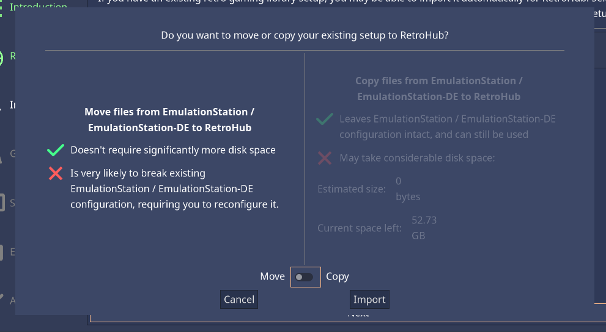
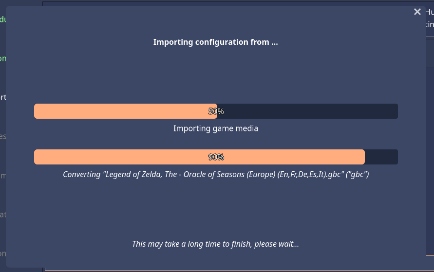
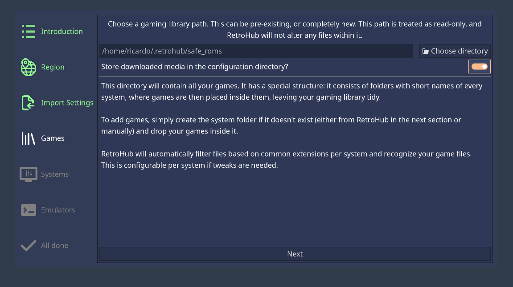

First Steps
===========

The first time you launch RetroHub, you'll be presented with a first-time wizard setup:

This setup will bootstrap your retro gaming library and set some default settings. Each section is described in more detail below.

.. note::
	To enable the screenreader, you can press ``Ctrl`` on this screen.

Region
------

Region is used to set up some set some behavior and visual settings used throughout the app. You can pick a region to use a preset of settings, or customize each type of setting:

- **Rating System:** Game age rating system to use.
- **Date Format:** Format to present date & time.
- **System Names:** Names to use for consoles with region-specific names.

.. note::
	Region settings are merely cosmetic and have no impact whatsoever on the games you can play.

Import Settings
---------------

.. image:: assets/02-import-settings.png

If you have an existing library setup on another frontend, RetroHub may be able to automatically import it. It will scan your files and show any valid apps found for you to import, as well as what kind of data it can be imported and any drawbacks:

- **Game metadata:** - Game text information, such as names, descriptions, publishers, release dates, play count, etc...
- **Game media:** - Game media, such as screenshots, videos, box arts, etc...
- **Themes:** Frontend specific themes which may work under a theme wrapper.

If you don't wish to import anything, you can also skip this step by picking ``Don't Import Settings``.

If you pick an app to import, you'll be asked whether you want to move or copy the media files *(game metadata files are always copied)*:

- **Moving** doesn't duplicate files, saving you disk space. However it will likely break your existing setup on the other frontend, requiring you to regenerate or recreate game information if you still intend to use it.
- **Copying** doesn't change any original files, leaving your original setup untouched. However it will consume more disk space, which can be a problem with very large libraries.

.. note::
	Although RetroHub shows an estimate of much space it would take to copy files, always ensure you have more space available before proceeding.

After one of these options, RetroHub will begin importing the files. This step may take some time.

Games
-----

.. note::
	If you imported an existing setup earlier, the game path may already be set to your existing library. If you choose a different path from what was detected, remember to move your games to the new location.

Here you should pick a folder for storing your games. This can either be empty or an existing one with games already.

This folder will have a defined structure to organize your games, consisting of folders with short system names, with games inside each corresponding folder:

.. code-block::

	games
	├── c64
	│   ├── game1.bin
	│   └── game2.d64
	├── gc
	│   ├── game1.iso
	│   └── game2.iso
	├── snes
	│   ├── game1.sfc
	│   └── game2.sfc
	└── ...

The system short names available can be checked at :doc:`/user_guide/systems/index`. The next section also allows you to bootstrap some or all system folders.

Each system has a set of file extensions associated, so RetroHub doesn't pick irrelevant files, such as text files. These extensions can also be configured per system later on.

.. note::
	You can also choose to store downloaded game media on a separate directory. If you wish to do so, disable the ``Store media in the configuration directory?`` option and pick a folder for storing media.

Systems
-------

Here you'll find a list of all the systems RetroHub supports by default. They are separated by categories such as game consoles or computers, so you can add only a given kind of systems to your library.

Pick any systems you want to support, and RetroHub will create folders for you to put the games under. If the game library already has some valid system folders, that system will be selected already, and cannot be deselected. Since RetroHub treats your game library as read-only later on, it cannot alter or delete any files. If you wish to remove a system, you'll need to either remove the folder in your library, or remove it from view in the settings.

You can also add custom systems and modify the default ones later on.

Emulators
---------

This section gives you an overview of what emulatores were detected and are thus expected to work right away. RetroHub is an emulator frontend, so it does not come with any pre-installed ones. You'll need to download, install and configure all your desired emulators previously before RetroHub can use them.

If RetroHub fails in finding an emulator, it shows the paths it tried to check on your system for its existence. If your emulator is working as intended, you may need to set its path manually later on.

All done
--------

After this setup, your retro gaming library is configured! RetroHub ships with a default theme for you to start playing right away, but if you want to customize the look and feel of the app, move on to the next section to learn how to download, install and use custom themes.