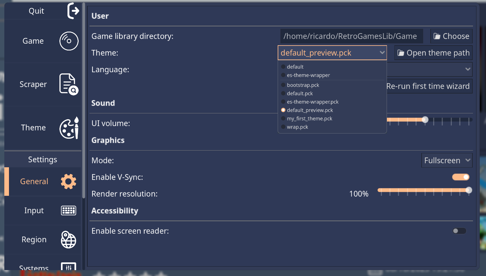

.. include:: /global/rh_links.rst

.. _user_guide_setup_themes:

Themes
===========

.. warning::
	Themes are essentially Godot projects. This means they run custom code, and can therefore be malicious.

	Be careful where you download themes from. We recommend downloading only themes from the app and/or trusted sources.

	A "Sandbox" mode for Godot is `in discussion <https://github.com/godotengine/godot-proposals/issues/5010>`_.

Downloading
~~~~~~~~~~~

*There currently aren't any existing community themes to download. This section will be documented once it gets more development.*

.. _user_guide_setup_themes_installing:

Installing
~~~~~~~~~~

To install themes, move the theme file (``.pck`` extension) inside the ``themes`` folder in RetroHub's config folder:

- **Windows:** ``C:\\Users\<user_name>\RetroHub\themes``
- **macOS:** ``/Users/<user_name>/.retrohub/themes``
- **Linux:** ``/home/<user_name>/.retrohub/themes``

You can also open the theme folder from the app's settings.

After that, pick your theme in the **General** settings. Themes above the separator are bundle by default, while the ones below it are downloaded.

All done
~~~~~~~~

With this, you're ready to enjoy your retro gaming library! There's more pages with information about the app, so feel free to explore them.

If you have any questions, you can contact us on |rh_discord| or |rh_reddit|.