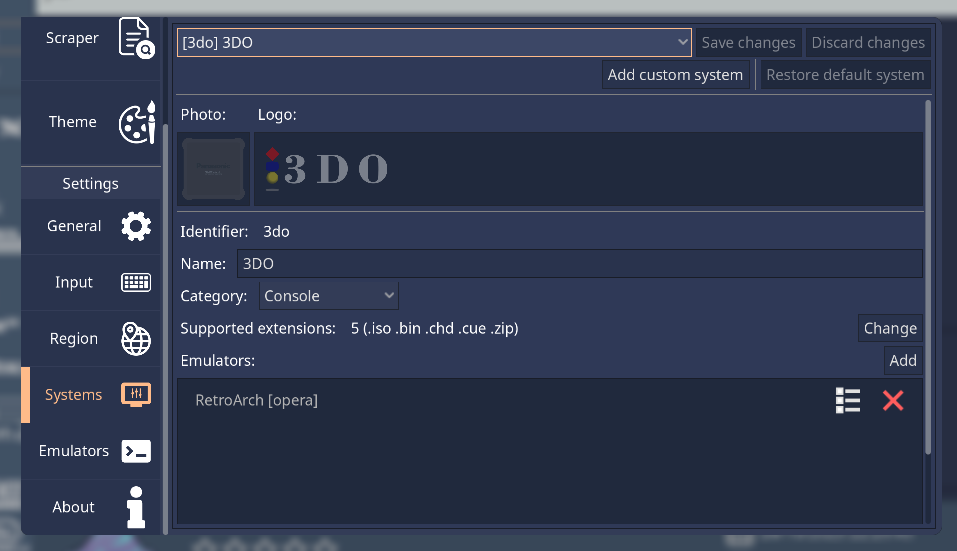
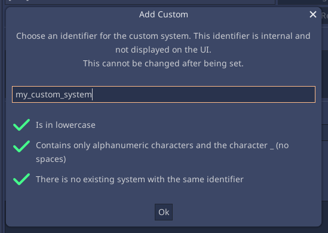
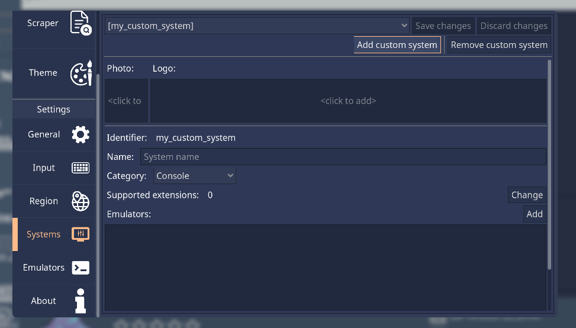

.. include:: /global/rh_actions.rst

Adding custom systems
=====================

.. warning::
	Themes will receive your custom system, but will likely not "know" your system, so it might be themed generically or even not show up at all.

There are two ways to achieve this:

Application
-----------

Open the Configuration UI (|action: rh_menu|), and navigate to the **Systems** section. Click on the ``Add custom system``.

This will bring a popup to choose a short system name. This is what's used internally to uniquely identify the system, and to create the system folder in your game library.

It must follow the following rules to be valid:

- Be lowercase
- Use only alphanumeric characters (a-z and 0-9) and the underscore character
- Not be an existing system short name

After that you must now set all the information relevant to that system in each available field, such as it's name, accepted game file extensions, and emulators to be used.

Manually
--------

Edit the ``rh_systems.json`` file in the configuration directory. Add a dictionary entry to the existing array, with the system information:

.. code-block:: json

	[
		{
			"name": "my_custom_system",
			"platform": "my_custom_system",
			"fullname": "My Custom System",
			"extension": [
				".abc",
				".rom"
			],
			"emulator": [
				"my_custom_emulator",
				{
					"retroarch": [
						"my_custom_core"
					]
				}
			],
			"category": "console"
		}
	]

For more information on the necessary keys and their values, see the :ref:`systems_spec` section.